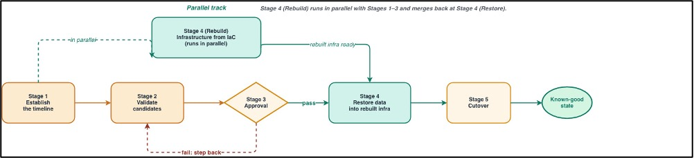
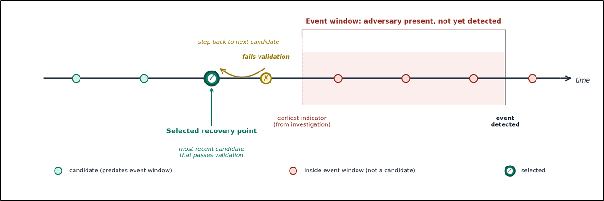

# Cyber Resilience trên AWS: Cách tiếp cận tham khảo để phục hồi sau ransomware và sự cố phá hủy

## Nguồn tham khảo

- AWS Architecture Blog: [Cyber resilience on AWS: A reference approach for recovery from ransomware and destructive events](https://aws.amazon.com/vi/blogs/architecture/cyber-resilience-on-aws-a-reference-approach-for-recovery-from-ransomware-and-destructive-events/)
- Tác giả: Ashish Panwar, Kanniah Vagathupatti Jaikumar, Rakesh Singh
- Ngày phát hành: 20/05/2026

## Tổng quan

Khi nhắc đến bảo mật, chúng ta thường nghĩ đến việc ngăn chặn tấn công hoặc phát hiện mối đe dọa càng sớm càng tốt. Tuy nhiên, bài viết của AWS nhấn mạnh thêm một khía cạnh rất quan trọng: **cyber resilience**, tức là khả năng khôi phục workload về một trạng thái đáng tin cậy sau khi môi trường đã bị ảnh hưởng bởi ransomware, data extortion hoặc các sự cố phá hủy.

Điểm mình thấy quan trọng nhất là: trong một sự cố nghiêm trọng, không thể mặc định production, credential, backup hoặc hạ tầng recovery vẫn còn an toàn. Vì vậy, chiến lược phục hồi không chỉ là "có backup", mà còn phải đảm bảo backup không bị xóa, môi trường phục hồi được cô lập, và dữ liệu được kiểm tra trước khi đưa trở lại production.

## Vấn đề cần giải quyết

Với các workload quan trọng trên AWS, ransomware có thể gây ra nhiều rủi ro hơn việc mã hóa dữ liệu. Kẻ tấn công có thể cố xóa backup, thay đổi cấu hình, đánh cắp credential, hoặc để lại thay đổi độc hại trong hệ thống trước khi bị phát hiện.

Nếu doanh nghiệp chỉ restore backup mới nhất mà không kiểm tra, backup đó có thể đã nằm trong khoảng thời gian bị xâm nhập. Khi đó, hệ thống mới có thể tiếp tục mang theo lỗi, mã độc hoặc cấu hình không đáng tin cậy.

Vì vậy, recovery plan cần trả lời được các câu hỏi:

- Backup có được bảo vệ khỏi việc bị xóa hay rút ngắn retention không?
- Môi trường phục hồi có tách biệt khỏi production bị ảnh hưởng không?
- Làm sao xác định recovery point nào đủ an toàn để dùng?
- Phần nào nên rebuild từ code, phần nào restore từ backup, và phần nào phải tạo mới?

## Kiến trúc phục hồi được đề xuất

Bài AWS đưa ra cách chia môi trường thành ba nhóm tài khoản chính trong AWS Organizations.

.png)

*Nguồn: AWS Architecture Blog - Cyber resilience on AWS*

### Production Account

Đây là nơi workload đang chạy thực tế. Khi xác nhận có sự cố nghiêm trọng, production account nên được cô lập để điều tra. Việc phục hồi không nên thực hiện trực tiếp trong production cũ, vì nếu môi trường này đã bị compromise thì các trust boundary, credential hoặc cấu hình hiện tại không còn đáng tin hoàn toàn.

### Recovery Account

Recovery Account là nơi quản lý backup quan trọng, đặc biệt là **AWS Backup logically air-gapped vault**. Vault này giúp bảo vệ recovery point khỏi việc bị xóa trong thời gian retention, kể cả khi root user hoặc administrator bị compromise.

Tài khoản này nên được giới hạn quyền bằng Service Control Policies (SCPs), chỉ tập trung vào hoạt động backup và restore. Như vậy, nếu production account bị tấn công, attacker không thể dễ dàng can thiệp vào backup control plane.

Một điểm đáng chú ý là logically air-gapped vault hoạt động với tư duy "recovery point phải tồn tại đủ lâu để có thể điều tra và phục hồi". Vault dùng chế độ bảo vệ chặt chẽ để ngăn việc xóa hoặc rút ngắn retention trong khoảng thời gian đã cấu hình. Với dữ liệu Amazon S3, bài viết cũng nhắc đến cách tiếp cận tương đương bằng **S3 Versioning** và **S3 Object Lock ở Compliance mode**, nhằm bảo vệ object version khỏi việc bị xóa hoặc ghi đè ngoài ý muốn.

### Isolated Recovery Environment (IRE)

IRE là môi trường dùng để restore, validate và rebuild workload mới trước khi cutover. Môi trường này không có trust relationship với production account, không VPC peering với production, và không expose trực tiếp ra Internet.

Cách thiết kế này giúp giới hạn rủi ro: nếu một backup được restore ra vẫn chứa threat, threat đó bị giữ trong môi trường cô lập thay vì lan ngược về production hoặc ra ngoài.

## Các dịch vụ AWS liên quan

- **AWS Backup**: quản lý backup và restore cho nhiều loại tài nguyên AWS.
- **AWS Backup logically air-gapped vault**: bảo vệ recovery point khỏi việc bị xóa trong thời gian retention.
- **AWS Resource Access Manager (AWS RAM)**: chia sẻ recovery point giữa các account.
- **Amazon S3 Versioning và S3 Object Lock**: bảo vệ dữ liệu S3 khỏi xóa hoặc ghi đè trong các tình huống cần retention nghiêm ngặt.
- **IAM Identity Center và Multi-party approval (MPA)**: yêu cầu nhiều người phê duyệt trước khi restore.
- **Amazon GuardDuty Malware Protection**: quét malware trên volume hoặc backup được restore.
- **AWS CloudTrail, VPC Flow Logs, AWS Security Hub**: hỗ trợ điều tra timeline và phát hiện hành vi bất thường.
- **AWS Config và IAM Access Analyzer**: kiểm tra dependency, policy, trust relationship và cấu hình liên quan khi cutover.
- **AWS PrivateLink / VPC endpoints**: cho phép IRE gọi AWS service API mà không cần mở Internet.

## Quy trình phục hồi tổng thể

Bài gốc không chỉ đưa ra các thành phần kiến trúc, mà còn mô tả cách vận hành recovery theo từng giai đoạn. Mình tóm tắt lại thành 5 bước chính:

*Nguồn: AWS Architecture Blog - Cyber resilience on AWS*

1. **Establish the timeline**: dựng lại timeline sự cố từ log, alert và dấu hiệu compromise.
2. **Validate candidates**: chọn các recovery point có khả năng an toàn và kiểm tra trong IRE.
3. **Approval**: yêu cầu phê duyệt trước khi dùng recovery point, đặc biệt với workload quan trọng.
4. **Rebuild and restore**: dựng lại hạ tầng sạch, restore dữ liệu đã validate, rotate toàn bộ secret.
5. **Cutover**: kiểm tra dependency, chuyển traffic sang môi trường mới và tiếp tục giám sát.

Điểm hay của workflow này là nó tránh cách làm vội vàng "restore backup mới nhất rồi mở lại hệ thống". Thay vào đó, mỗi bước đều có kiểm tra và phê duyệt để giảm nguy cơ đưa threat quay lại production.

## Validation pipeline: restore được chưa chắc đã an toàn

Một ý mình thấy rất thực tế là: restore thành công chỉ chứng minh backup còn đọc được, chưa chứng minh backup đó an toàn.

AWS đề xuất kết hợp nhiều lớp kiểm tra:

- Restore testing để xác nhận backup có thể phục hồi.
- Malware scanning để phát hiện mã độc hoặc công cụ mã hóa dữ liệu.
- Kiểm tra đặc thù theo workload, ví dụ database consistency check hoặc so sánh cấu hình với baseline.
- Review log và audit trail để tìm thay đổi bất thường về identity, network hoặc configuration.

Các bước validation nên chạy trong IRE. Chỉ khi recovery point vượt qua các kiểm tra này thì mới được phê duyệt để restore vào môi trường rebuilt.

## Chọn recovery point an toàn

Trong sự cố vận hành thông thường, backup mới nhất thường là lựa chọn tốt. Nhưng trong cyber event, backup mới nhất chưa chắc an toàn, vì attacker có thể đã tồn tại trong hệ thống trước thời điểm bị phát hiện.

*Nguồn: AWS Architecture Blog - Cyber resilience on AWS*

Cách tiếp cận hợp lý là:

1. Xây dựng timeline điều tra từ CloudTrail, VPC Flow Logs, GuardDuty, Security Hub và log của workload.
2. Xác định thời điểm sớm nhất có khả năng bắt đầu sự cố.
3. Chọn các recovery point trước mốc đó.
4. Validate từng recovery point, bắt đầu từ bản gần nhất.
5. Nếu validation fail, lùi về recovery point cũ hơn.
6. Ghi lại lý do chọn recovery point và người phê duyệt.

Cách này giúp giảm nguy cơ restore lại chính dữ liệu hoặc cấu hình đã bị ảnh hưởng.

## Kiểm tra trước khi cutover

Sau khi rebuild và restore thành công, vẫn chưa nên chuyển traffic ngay. Môi trường mới cần được kiểm tra kỹ các dependency với account, service và identity khác.

Một số điểm nên review trước cutover:

- IAM role trust policies và resource-based policies.
- AWS KMS key policy, grant và quyền decrypt/encrypt.
- Cross-account references hoặc service integrations đang trỏ về production cũ.
- Security group, route table, DNS record và endpoint configuration.
- Log forwarding, monitoring, alerting và backup plan cho môi trường mới.

Theo mình, đây là phần rất dễ bị bỏ sót trong recovery. Nếu chỉ restore được dữ liệu nhưng thiếu KMS permission, DNS cutover sai, hoặc IAM trust policy vẫn trỏ về account cũ thì hệ thống có thể chạy lỗi hoặc tiếp tục giữ lại rủi ro bảo mật.

## Framework Rebuild-Restore-Rotate

Bài viết tóm gọn recovery thành ba nhóm hành động rất dễ nhớ:

| Nhóm | Ví dụ | Cách xử lý |
| --- | --- | --- |
| Rebuild | VPC, security group, IAM role, Lambda, pipeline | Dựng lại từ Infrastructure as Code hoặc source đáng tin cậy |
| Restore | RDS, Aurora, EBS, EFS, FSx, dữ liệu nghiệp vụ | Khôi phục từ backup đã validate |
| Rotate | Password, API key, access key, certificate, SSH key | Tạo mới hoặc rotate, không dùng lại secret cũ |

Điểm quan trọng là không nên restore mọi thứ từ backup. Hạ tầng và cấu hình nên được dựng lại từ code đã review. Dữ liệu nghiệp vụ thì restore từ backup đã kiểm tra. Credential phải được thay mới vì không thể biết chắc chúng đã bị lộ hay chưa.

## Điều mình học được

Trước khi đọc bài này, mình thường nghĩ backup là yếu tố chính của disaster recovery. Sau khi tìm hiểu, mình nhận ra trong ransomware recovery, backup chỉ là một phần. Điều quan trọng hơn là backup có được bảo vệ không, restore ở đâu, validate như thế nào, và credential có được rotate đầy đủ không.

Mình cũng thấy mô hình tách account rất phù hợp với AWS vì AWS Organizations, SCP, RAM, Backup vault và IAM có thể kết hợp để tạo trust boundary rõ ràng. Đây là điểm khác biệt lớn so với việc chỉ lưu backup trong cùng production account.

## Kết luận

Cyber resilience trên AWS không chỉ là phòng thủ trước tấn công, mà là chuẩn bị để phục hồi khi một phần môi trường không còn đáng tin cậy. Cách tiếp cận với Recovery Account, IRE, logically air-gapped vault, validation pipeline và Rebuild-Restore-Rotate giúp doanh nghiệp có quy trình phục hồi rõ ràng hơn trước ransomware hoặc destructive events.

Nếu áp dụng vào một hệ thống thực tế, mình nghĩ các bước nên làm sớm là:

- Tạo Recovery Account và logically air-gapped vault cho workload quan trọng.
- Chuẩn bị IRE trước, không đợi đến lúc có sự cố mới dựng.
- Bật AWS Backup Restore Testing và kiểm thử restore định kỳ.
- Bật GuardDuty Malware Protection cho quy trình validation.
- Định nghĩa workload-specific integrity checks, ví dụ kiểm tra database, file hash hoặc cấu hình baseline.
- Viết runbook cho Rebuild-Restore-Rotate.
- Luyện tập credential rotation và cutover định kỳ.

Nếu đợi đến lúc sự cố xảy ra mới thiết kế recovery plan thì khả năng downtime và sai sót sẽ rất cao. Bài viết này giúp mình hiểu rằng cyber recovery là một quy trình cần được thiết kế, kiểm thử và luyện tập trước, giống như một phần bắt buộc của kiến trúc hệ thống chứ không phải tài liệu phụ sau khi triển khai.
