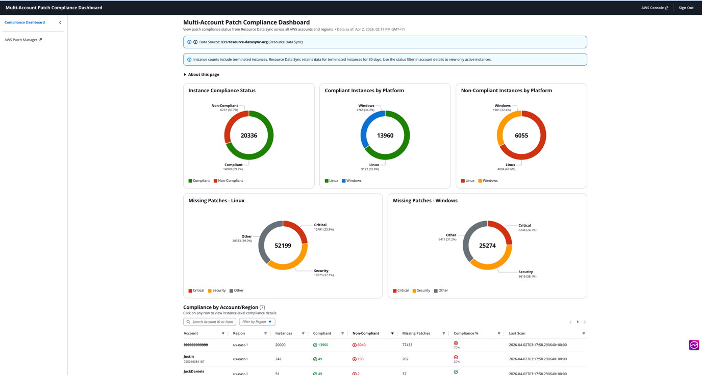

# Xây dựng Multi Account Patch Compliance Dashboard với Kiro Specs

## Nguồn tham khảo

- AWS Cloud Operations Blog: [Build a Multi Account Patch Compliance Dashboard with Kiro Specs](https://aws.amazon.com/vi/blogs/mt/build-a-multi-account-patch-compliance-dashboard-with-kiro-specs/)
- Tác giả: Justin Thomas
- Ngày phát hành: 09/06/2026

## Tổng quan

Patch management là một phần quan trọng trong vận hành hệ thống vì nó liên quan trực tiếp đến bảo mật, độ ổn định và compliance. Với một vài máy chủ hoặc một vài AWS account, việc theo dõi trạng thái patch có thể còn đơn giản. Nhưng khi tổ chức mở rộng lên hàng chục hoặc hàng trăm account, việc trả lời câu hỏi "toàn bộ hệ thống hiện có bao nhiêu instance chưa compliant?" trở nên khó hơn nhiều.

Bài viết của AWS giới thiệu cách xây dựng một **Multi Account Patch Compliance Dashboard** bằng **Kiro Specs**. Điểm mình thấy hay là bài không chỉ nói về dashboard, mà còn trình bày cách dùng spec-driven development để biến yêu cầu vận hành thành kiến trúc, task triển khai và source code hoàn chỉnh.

Dashboard này lấy dữ liệu patch compliance từ **AWS Systems Manager Patch Manager** thông qua **Resource Data Sync**, tổng hợp dữ liệu vào Amazon S3, rồi hiển thị dưới dạng giao diện web private. Người dùng truy cập dashboard thông qua **AWS Systems Manager Session Manager port forwarding**, không cần mở public endpoint ra Internet.

## Vấn đề cần giải quyết

AWS Systems Manager có nhiều tính năng hỗ trợ quản lý compliance như Inventory, Explorer và Compliance. Resource Data Sync có thể export dữ liệu inventory và patch compliance ra Amazon S3. Tuy nhiên, khi dữ liệu đến từ nhiều account và nhiều Region, việc tổng hợp thủ công hoặc đọc trực tiếp hàng ngàn file trong S3 mỗi lần mở dashboard sẽ không hiệu quả.

Một dashboard patch compliance thực tế cần đáp ứng các yêu cầu:

- Hiển thị nhanh tổng số instance, tỷ lệ compliant và non-compliant.
- Tổng hợp dữ liệu từ nhiều AWS account.
- Cho phép drill down từ account xuống từng instance.
- Cho biết patch nào đang thiếu và mức độ severity.
- Không expose dashboard ra Internet.
- Có chi phí thấp và phù hợp với mô hình serverless.
- Có quy trình triển khai rõ ràng, dễ kiểm tra và dễ mở rộng.

## Kiến trúc giải pháp

Bài gốc đề xuất một kiến trúc serverless, private và tập trung vào khả năng vận hành.

Luồng hoạt động chính như sau:

1. Người dùng chạy lệnh **SSM Session Manager port forwarding** để forward local port đến internal Application Load Balancer thông qua bastion host.
2. Người dùng mở `https://localhost:8443/` trên trình duyệt.
3. Request đi qua SSM tunnel đến bastion host, sau đó đến **internal Application Load Balancer** trong private VPC.
4. ALB route request frontend đến **Frontend Lambda**, Lambda này phục vụ React application được lưu trong Dashboard S3 bucket.
5. React app gọi API như `/api/compliance-summary` hoặc `/api/compliance-detail`.
6. **API Lambda** đọc dữ liệu đã được aggregate sẵn từ prefix `/cache/` trong Dashboard S3 bucket.
7. **Cache Compute Lambda** được kích hoạt định kỳ mỗi 30 phút bằng Amazon EventBridge, đọc raw data từ Resource Data Sync bucket, tổng hợp lại và ghi cache JSON vào Dashboard S3 bucket.

Điểm quan trọng là frontend không đọc trực tiếp dữ liệu raw từ Resource Data Sync bucket. Dữ liệu raw được chuyển thành cache đã tổng hợp trước, giúp dashboard tải nhanh hơn và tách rõ nguồn dữ liệu khỏi nơi phục vụ giao diện.

## Các dịch vụ AWS liên quan

| Dịch vụ | Vai trò trong giải pháp |
| --- | --- |
| AWS Systems Manager Patch Manager | Quản lý và thu thập trạng thái patch compliance của managed nodes |
| AWS Systems Manager Resource Data Sync | Export inventory và compliance data ra Amazon S3 |
| Amazon S3 | Lưu raw compliance data, frontend assets và cache JSON đã tổng hợp |
| AWS Lambda | Xử lý frontend, API request và cache aggregation |
| Amazon EventBridge | Kích hoạt Cache Compute Lambda theo lịch 30 phút |
| Application Load Balancer | Route request nội bộ đến các Lambda target |
| Amazon VPC | Chạy kiến trúc private với private subnet và internal ALB |
| Session Manager | Cho phép truy cập dashboard private thông qua port forwarding |
| AWS CloudFormation | Triển khai bucket, network, compute và các thành phần hạ tầng |
| CloudWatch Logs / VPC Flow Logs / ALB logs | Ghi log phục vụ vận hành và audit |

## Vì sao kiến trúc này ưu tiên bảo mật?

Điểm mình thấy đáng chú ý nhất là dashboard không được public ra Internet. Thay vì dùng public ALB hoặc CloudFront, người dùng phải có AWS credential và quyền SSM phù hợp để mở tunnel.

Bài viết nhấn mạnh một số quyết định bảo mật:

- **Zero public attack surface**: ALB là internal-only, Lambda chạy trong private subnet và không có public endpoint.
- **Private-only access pattern**: dashboard phù hợp với môi trường enterprise yêu cầu công cụ nội bộ không truy cập được từ Internet.
- **Strict data separation**: Resource Data Sync bucket chỉ đóng vai trò nguồn đọc; Dashboard S3 bucket riêng dùng để chứa cache và frontend assets.
- **Encryption in transit and at rest**: ALB dùng HTTPS, S3 bật encryption và bucket policy có thể chặn non-TLS request.
- **Comprehensive logging**: VPC Flow Logs, ALB access logs và CloudWatch Log Groups giúp theo dõi hoạt động hệ thống.

Theo mình, đây là lựa chọn hợp lý vì dashboard compliance thường chứa thông tin nhạy cảm: account nào có instance chưa patch, nền tảng nào đang thiếu bản vá, và patch severity ra sao. Nếu dashboard này public sai cách thì nó có thể trở thành nguồn thông tin hữu ích cho attacker.

## Kiro Specs và spec-driven development

Phần thú vị nhất của bài là cách dùng **Kiro** để xây dựng giải pháp theo hướng spec-driven development. Thay vì chỉ prompt AI viết code ngay, Kiro chia quá trình thành ba giai đoạn:

1. **Requirements**: xác định cần xây dựng gì, dashboard phải hiển thị dữ liệu nào và tiêu chí chấp nhận là gì.
2. **Design**: xác định kiến trúc, data flow, component responsibility, API contract và cache schema.
3. **Tasks**: chia implementation thành các task cụ thể theo thứ tự hợp lý.

Cách làm này giúp giảm rủi ro khi dùng AI coding assistant. Nếu nhảy thẳng vào code, AI có thể tạo ra kiến trúc không đúng yêu cầu bảo mật hoặc đọc dữ liệu không tối ưu. Với Kiro Specs, các quyết định quan trọng được ghi lại trong spec trước, sau đó mới chuyển sang implementation.

## Steering files: giữ ngữ cảnh cho AI

Bài viết sử dụng các **steering files** trong thư mục `.kiro/steering/`. Đây là các file Markdown mà Kiro tự động đưa vào ngữ cảnh khi làm việc. Mục tiêu là không phải giải thích lại project convention, kiến trúc và quy tắc bảo mật trong mỗi lần trò chuyện.

Các steering files chính gồm:

- **architecture.md**: mô tả internal ALB, Lambda targets, private VPC, SSM access, EventBridge cache refresh và thông số Lambda.
- **data-schemas.md**: mô tả cấu trúc dữ liệu từ Resource Data Sync và định dạng cache cho summary/detail view.
- **compliance-logic.md**: định nghĩa business rules, ví dụ instance chỉ compliant khi `MissingCount = 0` và `InstalledPendingRebootCount = 0`.
- **frontend-specs.md**: mô tả layout, UI component và cách dùng Cloudscape Design System.
- **security.md**: mô tả baseline bảo mật như HTTPS-only, S3 encryption, least privilege IAM, security headers, input validation và dependency pinning.

Theo mình, steering files là phần rất thực tế. Khi làm việc với AI, kết quả tốt hay không phụ thuộc nhiều vào context. Nếu context được viết thành file rõ ràng, AI có thể tạo requirement, design và task nhất quán hơn.

## MCP servers để kiểm tra kết quả

Steering files giúp Kiro biết phải xây gì, còn MCP servers giúp kiểm tra thứ Kiro tạo ra. Bài viết đề xuất dùng các MCP servers của AWS như:

- **Security Scanner MCP** để scan vấn đề bảo mật.
- **AWS IaC MCP Server** để kiểm tra Infrastructure as Code theo best practices.

Điểm mình rút ra là AI không nên chỉ được dùng để sinh code. Nó cũng nên được kết hợp với công cụ validation để kiểm tra code, CloudFormation template và kiến trúc có đi đúng best practices hay không.

## Dashboard hiển thị gì?

Dashboard được thiết kế thành hai tầng:



*Nguồn: AWS Cloud Operations Blog - Build a Multi Account Patch Compliance Dashboard with Kiro Specs*

### Main view

Main view giúp team trả lời nhanh câu hỏi tổng quan:

- Tổng số instances.
- Compliance rate.
- Số lượng compliant và non-compliant instances.
- Biểu đồ compliance status.
- Biểu đồ phân loại theo platform như Linux hoặc Windows.
- Biểu đồ missing patches theo severity.
- Bảng account để biết account nào cần xử lý trước.

### Detail view

Khi click vào một account, người dùng có thể xem chi tiết hơn:

- Danh sách instances trong account.
- Instance nào đang non-compliant.
- Số lượng patch còn thiếu.
- Thời điểm scan gần nhất.
- Danh sách patch cụ thể đang thiếu và số instance bị ảnh hưởng.

Cách chia này hợp lý vì người vận hành thường cần nhìn tổng quan trước, sau đó mới đi sâu vào account hoặc instance có vấn đề.

## Triển khai và vận hành

Bài gốc hướng dẫn dùng Kiro tạo deployment script để triển khai và xóa tài nguyên. Script deploy có nhiệm vụ build frontend, đóng gói Lambda, triển khai các CloudFormation stacks theo thứ tự, tạo TLS certificate tự ký cho internal ALB, upload assets, cập nhật Lambda code và kích hoạt cache Lambda để dashboard có dữ liệu trước khi người dùng truy cập.

Sau khi triển khai, script in ra lệnh SSM port forwarding tương tự:

```bash
aws ssm start-session \
  --target <bastion-instance-id> \
  --document-name AWS-StartPortForwardingSessionToRemoteHost \
  --parameters '{"host":["<alb-dns-name>"],"portNumber":["443"],"localPortNumber":["8443"]}'
```

Sau đó người dùng mở `https://localhost:8443/` để truy cập dashboard.

Bài cũng nhắc đến cleanup để tránh phát sinh chi phí, bao gồm xóa CloudFormation stacks, empty S3 buckets, xóa VPC, ALB, Lambda functions, bastion instance và ACM certificate.

## Những điểm có thể mở rộng

Giải pháp trong bài là nền tảng ban đầu, không phải sản phẩm cuối cùng cho mọi tổ chức. Một số hướng mở rộng đáng chú ý:

- Thêm Amazon Cognito authentication cho nhiều người dùng.
- Server-side pagination nếu có hơn 10.000 instances.
- Tạo custom widgets cho metric compliance riêng.
- Tích hợp Amazon SNS để gửi cảnh báo compliance.
- Tích hợp Amazon Inspector để xem CVE liên quan đến patch còn thiếu.

## Điều mình học được

Trước khi đọc bài này, mình thường nghĩ dashboard compliance chỉ là phần frontend hiển thị dữ liệu. Sau khi tìm hiểu, mình thấy phần khó hơn nằm ở kiến trúc dữ liệu và bảo mật truy cập.

Nếu đọc trực tiếp dữ liệu raw từ S3 mỗi lần mở dashboard, hệ thống có thể chậm và tốn chi phí khi số account tăng lên. Việc tạo cache định kỳ bằng Lambda và EventBridge giúp tách quá trình xử lý nặng khỏi request của người dùng.

Mình cũng thấy Kiro Specs là một cách làm tốt khi dùng AI để xây dựng hệ thống có yêu cầu rõ ràng. Thay vì để AI tự suy đoán, mình cung cấp steering files, yêu cầu, design và task. Cách này khiến kết quả dễ kiểm soát hơn, đặc biệt với các phần nhạy cảm như IAM, network private access và security baseline.

## Kết luận

Bài viết này cho thấy cách kết hợp AWS Systems Manager, Resource Data Sync, Lambda, S3, EventBridge, internal ALB và Session Manager để xây dựng một dashboard patch compliance nhiều account theo hướng serverless và private.

Điểm nổi bật không chỉ nằm ở dashboard, mà còn ở quy trình phát triển bằng Kiro Specs. Khi yêu cầu, kiến trúc, security rules và task được mô tả rõ ràng từ đầu, AI coding assistant có thể hỗ trợ triển khai nhanh hơn nhưng vẫn giữ được tính kiểm soát.

Nếu áp dụng vào môi trường thực tế, mình nghĩ các bước quan trọng nhất là chuẩn hóa Resource Data Sync, định nghĩa compliance logic rõ ràng, thiết kế private access ngay từ đầu, và kiểm tra generated infrastructure bằng các công cụ validation trước khi triển khai production.
